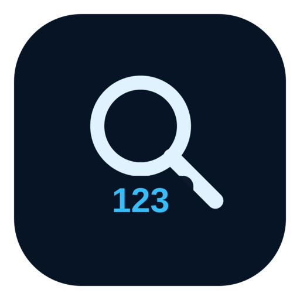
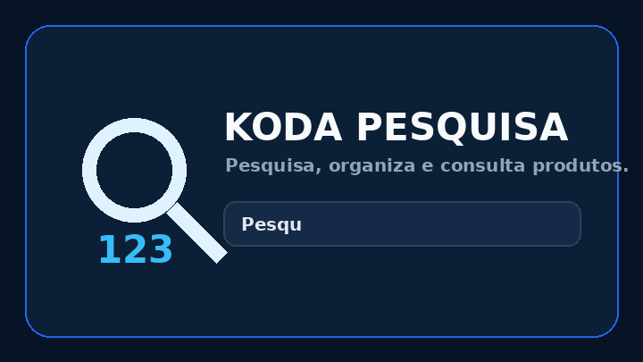

# 🔎 KODA PESQUISA

<p align="center">
  
</p>

<p align="center"><strong>Encontre, organize e acesse seus produtos com rapidez e praticidade.</strong></p>

<p align="center">
  
  
  
</p>

<p align="center">
  
</p>

> **KODA PESQUISA** é um sistema mobile-first para cadastro, organização e consulta de produtos. A versão 1.4.0 adiciona a base de conta Google + Firebase, sincronização entre dispositivos, perfil com avatar, experiência PWA e uma interface adaptada também para computadores.

---

## ✨ O que o sistema oferece

- 🔎 Pesquisa rápida por nome, código, preço e informações disponíveis.
- 🗂️ Categorias com cores para identificação visual.
- ➕ Cadastro e edição de produtos.
- 🗑️ Lixeira com restauração e exclusão definitiva.
- 🕘 Histórico das operações realizadas.
- 📥 Importação de JSON/CSV.
- 📤 Exportação de JSON/CSV para backup.
- 🌙 Tema claro e escuro.
- 📱 Interface otimizada para celular e PWA.
- 🖥️ Navegação lateral e layout adaptado para computador.
- 🔐 Login com Google via Firebase Authentication.
- ☁️ Sincronização dos dados por conta via Cloud Firestore.
- 👤 Exibição da foto de perfil da conta Google.
- 🔄 Atualização do aplicativo controlada pelo Service Worker.
- 🆕 Modal de nova versão com resumo das mudanças e opções **Atualizar agora** / **Mais tarde**.
- 💾 Funcionamento local mesmo sem conta conectada.

---

## 🧭 Como funciona a conta

O KODA PESQUISA mantém o funcionamento local mesmo sem login. Quando o usuário conecta uma conta Google, os dados passam a poder ser sincronizados com o Firestore e recuperados em outro aparelho usando a mesma conta.

### Primeiro acesso com dados locais

```text
Produtos neste aparelho
        ↓
     Login Google
        ↓
Sincronização inicial
        ↓
   Conta no Firebase
```

### Acesso em outro aparelho

```text
Outro aparelho
      ↓
 Login Google
      ↓
 Dados da conta
      ↓
Produtos recuperados
```

Se existirem dados locais e dados na nuvem ao mesmo tempo, o sistema apresenta uma tela de conflito e exige uma escolha explícita antes de substituir qualquer conjunto de dados.

---

## 🔐 Firebase

O projeto usa:

- **Firebase Authentication** → login Google.
- **Cloud Firestore** → armazenamento/sincronização dos dados por usuário.
- **Google Analytics** → habilitado no projeto Firebase, quando desejado para métricas agregadas.

### Estrutura atual do Firestore

```text
usuarios
└── {uid-do-usuario}
    ├── products
    ├── cats
    ├── history
    ├── trash
    └── updatedAt
```

### Regras de segurança

O arquivo `firestore.rules` contém a regra de produção usada como base:

```text
match /usuarios/{userId} {
  allow read, write: if request.auth != null
                    && request.auth.uid == userId;
}
```

Isso significa que um usuário autenticado só pode acessar o documento cujo ID corresponde ao próprio UID.

> **Importante:** mantenha as Security Rules publicadas no Firebase Console. Não use regras abertas para produção.

---

## ⚙️ Configuração do Firebase

O aplicativo Web está preparado com a configuração do projeto **koda-pesquisa**. Antes de testar o login Google, confira no Firebase Console:

1. **Authentication → Sign-in method → Google → Ativado**.
2. **Firestore Database → Rules → publicar `firestore.rules`**.
3. **Authentication → Settings → Authorized domains**: confirme o domínio onde o PWA será publicado.
4. Para o endereço de produção, adicione o domínio da hospedagem antes de testar o login nesse domínio.

A configuração pública do aplicativo Web fica no `index.html`. As permissões reais são controladas pelas regras do Firebase.

---

## 📱 PWA e atualizações

O projeto contém:

- `manifest.webmanifest` para instalação.
- `sw.js` para cache e funcionamento offline do shell da aplicação.
- Ícones `192x192` e `512x512`.
- Controle de versão do cache.

Quando uma versão nova for publicada, o Service Worker pode detectar a atualização e o sistema apresenta:

> **Nova versão disponível**
>
> Veja o que mudou e escolha **Atualizar agora** ou **Mais tarde**.

Isso evita que uma atualização de interface seja aplicada de forma inesperada enquanto o usuário está utilizando o sistema.

---

## 🖥️ Experiência em computador

Em telas maiores, o KODA PESQUISA muda automaticamente para um layout de desktop:

- menu lateral fixo;
- atalhos para Conta, Categorias, Histórico e Lixeira;
- importação/exportação pelo menu lateral;
- área central mais larga;
- lista de produtos distribuída em colunas;
- mesma identidade visual do modo celular.

No celular, a navegação compacta continua sendo utilizada.

---

## 🧩 Estrutura do projeto

```text
KODA_PESQUISA/
├── index.html                 # Aplicação principal
├── manifest.webmanifest       # Configuração PWA
├── sw.js                      # Service Worker e atualização
├── firestore.rules            # Regras de segurança do Firestore
├── README.md                  # Documentação principal
├── assets/
│   ├── favicon.png
│   ├── icon-192.png
│   ├── icon-512.png
│   └── koda-pesquisa-logo.svg
└── docs/
    └── koda-pesquisa-preview.gif
```

---

## 🎨 Identidade visual

A marca utiliza o conceito de **lupa + identificação numérica**, representando pesquisa e localização rápida de produtos.

Arquivos disponíveis:

- `assets/koda-pesquisa-logo.svg` → logo vetorial principal.
- `assets/icon-192.png` → ícone PWA 192×192.
- `assets/icon-512.png` → ícone PWA 512×512.
- `assets/favicon.png` → favicon.
- `docs/koda-pesquisa-preview.gif` → prévia animada para o README.

### Como trocar uma imagem posteriormente

Se uma nova arte for criada, mantenha os mesmos nomes e caminhos sempre que possível. Assim, o README e o PWA continuam apontando para os arquivos corretos:

```text
assets/icon-192.png
assets/icon-512.png
assets/favicon.png
assets/koda-pesquisa-logo.svg
docs/koda-pesquisa-preview.gif
```

---

## 🚀 Executar localmente

O projeto continua simples e pode ser aberto diretamente no navegador para uso local.

Para testar **PWA, Service Worker e login Google**, é recomendado usar uma hospedagem HTTPS, como GitHub Pages, Vercel ou outro servidor web compatível.

### GitHub

```bash
git clone https://github.com/SEU_USUARIO/koda-pesquisa.git
cd koda-pesquisa
```

Depois publique os arquivos do projeto no repositório.

> Substitua `SEU_USUARIO` pelo usuário/organização real do repositório.

---

## 📦 Backup e migração

O sistema possui exportação JSON e CSV. O JSON é a opção indicada para preservar uma cópia estruturada dos produtos.

A sincronização Firebase não substitui o backup local: recomenda-se manter exportações periódicas quando a base for importante.

---

## 🧪 Checklist da versão 1.4.0

- [x] Firebase configurado para o projeto KODA PESQUISA.
- [x] Google Authentication preparado.
- [x] Firestore preparado.
- [x] Regras por UID.
- [x] Sincronização inicial local → conta.
- [x] Recuperação conta → aparelho.
- [x] Tratamento de conflito local/nuvem.
- [x] Avatar da conta Google.
- [x] PWA manifest.
- [x] Service Worker.
- [x] Detecção de atualização.
- [x] Modal Atualizar agora / Mais tarde.
- [x] Layout responsivo para desktop.
- [x] Menu lateral no computador.
- [x] Tema claro/escuro preservado.
- [x] Lista compacta preservada.
- [x] Categorias com identidade cromática.
- [x] Sem produtos fictícios pré-carregados.

---

## 🗺️ Evolução planejada

```text
v1.3.0  →  Refinamento de UX/UI
   ↓
v1.4.0  →  Conta Google + Firebase + sincronização + PWA + desktop
   ↓
v1.5.x  →  Refinamentos de sincronização, atualização e experiência
   ↓
futuro  →  Recursos avançados do ecossistema KODA
```

A regra do projeto continua sendo:

**EVOLUIR > RECONSTRUIR**

---

## 🏢 Koda Sistemas

**KODA PESQUISA** faz parte dos projetos da **Koda Sistemas**, com foco em soluções simples, práticas e eficientes para uso cotidiano.

> Feito para organizar melhor o que você precisa encontrar.

---

## 📄 Licença

Defina aqui a licença que será adotada oficialmente pelo projeto antes de torná-lo um produto de distribuição pública.
